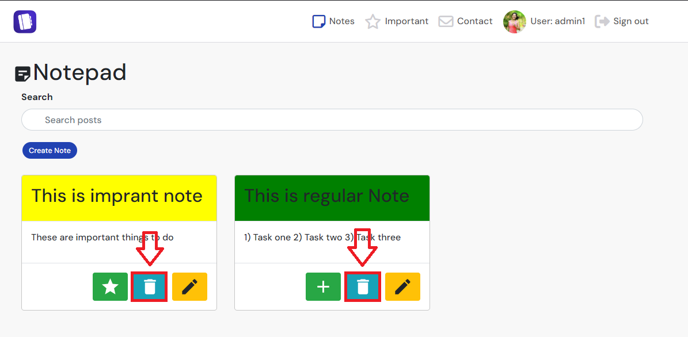

# SnapFood 

**Developer: Aleksandra Haniok**

💻 [Visit live website](https://ci-pp5-snapfood.onrender.com/)


## Table of Contents
  - [About](#about)
  - [Project Goals](#project-goals)
  - [User Stories](#user-stories)
  - [Design](#design)
    - [Colours](#colours)
    - [Fonts](#fonts)
    - [Wireframes](#wireframes)
  - [Technologies Used](#technologies-used)
    - [Languages](#languages)
    - [Libraries, frameworks and dependencies](#libraries-frameworks-and-dependencies)
    - [Tools & Programs](#tools--programs)
  - [Front-End](#front-end)
  - [Back-End API](#back-end-api)
  - [Features](#features)
  - [Future features / improvements](#future-features--improvements)
  - [Validation](#validation)
  - [Testing](#testing)
    - [Manual testing of user stories](#manual-testing-of-user-stories)
    - [Performing tests on various devices](#performing-tests-on-various-devices)
    - [Browser compatibility](#browser-compatibility)
  - [Bugs](#bugs)
  - [Config](#config)
  - [Credits](#credits)


## About

"Le Note” is a note application. Customers may use this application to organize their day-to-day life. They may create a note, like it, delete it, or update it. The application provides a view for important notes. Customers may send feedback to the website developer to share feedback.


## Project Goals

The objective for this project was to develop an application that allows users to manage their notes in various ways such as creating, liking, deleting, or updating them. The concept was to keep the application user-friendly and for the purpose of enhancing productivity.e.

The key functionality aspects:
- Simple and intuitive navigation across all notes
- User authentication
- User interaction via creating, liking, deleting, and updating notes
- User profiles with their description and images
- CRUD functionality for notes
- Notes filtering by liked notes
- Search field, which allows user to search for notes by using keywords.
- Responsiveness to allow users to use the app on various devices


## User Stories

### First sprint


#### Authentication 

1. As a new user, I can create a new account.
2. As a user who has an account, I want to be able to log in to my account.
3. As a user, I can use links to navigate from the login page to the sign-up page and back.
4. As a login user I want to log out from my account

#### Navigation 


5. As a user, I can access a navigation bar on all pages, allowing me to conveniently navigate back to the main page or visit my profile page.

 
### Second sprint

#### Note Page/Important page

6. As a user, I can create notes to organize my thoughts and tasks.
7. As a user, I can view the details of a single note to see its title and content.
8. I can use the “Delete” button to delete a note.
9. I can use the like/unlike button to mark a note as important.
10. I can identify if the note is liked by the modal title or icon which appears on the “Like/Unlike” button.
11. I can use the search field to search for a note according to keywords in the title.
12. I can edit the content of a note by clicking the “Edit” option on each note.
13. I want to see only important notes on the “Important” page.

#### Edit page
14. I want to return from the “Edit Note” page to the “Note” page without modifying the content of the note.

### Third sprint

#### Contact Form

15. I want to be able to send feedback email to owner of the site.


#### User Profile Page 

16. As a user, I can update my profile picture.
17. As a user, I can change my username.
18. As a user, I can update my password.

#### General

19. As a user of the application, I can see ReactBootstrap alerts after completing different actions, for example: creating a note, deleting a note, liking a note, editing a note, changing the password, changing the username, changing the profile picture, etc.


##### Back to [top](#table-of-contents)


## Design

### Colours

The application employs a palette of bright yet neutral and warm colours, designed to evoke a sense of calm and allow users to focus on their notes without being distracted by other graphical elements. The background of the application is a light grey, complemented by a matching navigation bar. The main content is housed within white containers. Action buttons, text highlights, and the search bar are rendered in a contrasting darker shade. This colour scheme is consistently applied across all pages to ensure sufficient contrast and enhance user experience.

### Fonts

The website has been designed using Google Fonts. The “Poppins” font, with sans-serif as a fallback, was utilized across the site to guarantee the content’s readability.


### Wireframes

<details><summary>Sign In Page</summary>
    
</details>
<details><summary>Sign Up Page</summary>
    
</details>
<details><summary>Contact Form</summary>
    
</details>
<details><summary>Main Note Page</summary>
    
</details>
<details><summary>Important Note Page</summary>
    
</details>
<details><summary>Edit Form Page</summary>
    
</details>
<details><summary>User Page</summary>
    
</details>
<details><summary>404 Page</summary>
    
</details>


##### Back to [top](#table-of-contents)


## Technologies Used

### Languages

- HTML
- CSS
- Javascript
  - React 

### Libraries, frameworks and dependencies

- [Axios](https://axios-http.com/docs/intro) - Axios was employed as a promise-based HTTP client in the project. It was used to  send API requests from the React application to the API, effectively preventing any CORS errors during the transmission of cookies.
- [ClassNames](https://www.npmjs.com/package/classnames/) - ClassNames were used as "class" in standard css.
- [JWT](https://jwt.io/) - The utilization of JSON Web Tokens (JWT) was instrumental in precluding unauthenticated users from initiating superfluous network requests for access token renewal. Furthermore, it facilitated the elimination of the timestamp from the browser in instances where the token expired upon user refresh or the user opted to log out
- [React](https://17.reactjs.org/) - JavaScript library for building front end of the application. 
- [React-Bootstrap 4.6](https://react-bootstrap-v4.netlify.app/) -  The Bootstrap React library was employed to construct the user interface on the front-end.
- [React Infinite Scroll](https://www.npmjs.com/package/react-infinite-scroll-component) - This component was employed to enable the automatic loading of content to avoid pagination, so the user could see the content without distruptions
- [React Router](https://v5.reactrouter.com/web/guides/quick-start) - This library was used for dynamic routing. 

### Tools & Programs

- [Am I Responsive](http://ami.responsivedesign.is/) Was used to verify if the site is responsive
- [Balsamiq](https://balsamiq.com/) was used as wireframes creation tool
- [Chrome dev tools](https://developers.google.com/web/tools/chrome-devtools/) was used for code debugging and for checking the responsivenes of a website
- [Cloudinary](https://cloudinary.com/) It was used to store static files and images
- [Font Awesome](https://fontawesome.com/) - Icons sourced from Font Awesome were extensively incorporated across the website.
- [MUI](https://mui.com/material-ui/material-icons/) - Icons from Material UI were used in parallel to Font Awesome.
- [Google Fonts](https://fonts.google.com/) - Was used for font input.
- [GitHub](https://github.com/) Was used as a code repository.
- [Gitpod](https://gitpod.io) was used as IDE development tool
- [Heroku](https://heroku.com) was used to deploy the project into live environment
- Validation:
  - [WC3 Validator](https://validator.w3.org/) was used to validate the html
  - [Jigsaw W3 Validator](https://jigsaw.w3.org/css-validator/) was used to validate the css
  - [ESLint](https://eslint.org/) used to validate JSX code
  - [Lighthouse](https://developers.google.com/web/tools/lighthouse/) It was employed to verifying the performance, accessibility, adherence to best practices, and Search Engine Optimization (SEO) of the application.
  - [Wave](https://wave.webaim.org/) - It was employed to assess the accessibility of the application

##### Back to [top](#table-of-contents)


## Front-End

### React

React.js, an open-source JavaScript library, was developed by Jordan Walke, a software engineer at Meta (formerly Facebook). It serves as a powerful framework for creating interactive user interfaces and web applications more efficiently than using vanilla JavaScript. React’s focus on components allows developers to build reusable UI elements, making it a popular choice for single-page applications and beyond

I used React for this application for several reasons:

Flexibility: React’s modular structure makes its code easier to maintain compared to other front-end frameworks. 

Speed: When building sites or apps with React, the page loading speed significantly improves because the entire page doesn’t need to refresh and reload all components. Instead, components are updated dynamically, reducing wait times and enhancing the overall user experience.

React Bootstrap is an excellent choice for styling and ensuring responsiveness. It provides a collection of ready-to-use React components, significantly reducing the need to create commonly used code from scratch. With React Bootstrap, you can streamline your development process and enhance the user experience. 

React is the go-to library for developing social networking and media content applications. Notably, major platforms like Meta (formerly Facebook), Instagram, Netflix, and Airbnb have all been built using React1. Its versatility and robustness make it a top choice for creating dynamic and interactive web experiences.

Reusability of components – Components can be created and re used throughout the app with no need to re write code for the same features.

- `<NavBar />` - This is a reusable component that generates a navigation bar. It displays different options for logged-in and logged-out users. For logged-out users, it shows ‘Sign In’ and ‘Sign Up’ options. For logged-in users, it displays ‘Notes’, ‘Important’, ‘Contact Page’, ‘Profile Page’, and ‘Sign Out’ options
  - User stories covered: 

- `<Footer />` - This is a reusable component that generates a footer of the page. It has copyright information and social media links.
  - User stories covered: 

- `<NotFount />` - This is a reusable component that generates 404 error when the user tries to visit incorrect page. 
  - User stories covered: 


- `<Avatar />` - This is a reusable component used to configure the profile picture size in the UI.
  - User stories covered: 

- `<CrateArea />` - This is a reusable component used to create a new notes. This component is assigned to Notesall page.
  - User stories covered: 

- `<EditNote />` - This is a reusable component used to modify the note: content, title, like status. T
  - User stories covered: 


- `<FeedbackMsg />` - component for displaying feedback messages to the user upon editing/deleting comments, deleting post, updating profile information or a password.
  - User stories covered: 35

- `<Landing />` - specific component for displaying a landing page for new / not logged-in users, which contains links to sign up and log in, in addition to the navbar.
  - User stories covered: 1

- `<LikeFeedAddPost />` - reusable component containing 3 icons to add a post, show liked post or show posts by profiles the users follows. Displayed on various pages of the app.
  - User stories covered: 7, 21, 22

- `<NavBar />` - reusable component with the content depending on the login status of the user. For logged in user it shows icon link to the main posts page and user avatar/picture. For those who are not logged in, it displays icon links to sign up or log in instead of the avatar. The component is used on each page of the app.
  - User stories covered: 2, 3

- `<PageNotFound />` - specific component for displaying a 404 graphic error message with a return to menu button when user enters the url which does not exist.
  - User stories covered: 34

- `<PasswordCriteria />` - reusable component containing password criteria which are displayed on button hover or focus. Used on sign up page and profile password change page.
  - User stories covered: 4, 28

- `<PopularProfiles />` - reusable component showing first three most followed profiles in the app. The component displays user avatar, name and follow/unfollow button. These buttons are hidden on medium screen size devices. The component is used across the app together with the `<LikeFeedAddPost />` component and post categories badges on relevant pages.
  - User stories covered: 32


## Back-End API

### Django REST Framework

The Application Programming Interface (API) for this front-end application was constructed utilizing the Django REST Framework. For more information DRF you may click here. [here]https://www.django-rest-framework.org/).

##### Back to [top](#table-of-contents)


## Features


### Login Form
- Is used for a use to login to his account. User must have an account to login.
- To login user needs to add username and password. Both fields are mandatory to login
- Once a user loggs in he is navigated to notes page. 
- Warning message is displayed on incorrect input
- User stories covered: 

<details><summary>See feature screenshot</summary>

</details>

### Sign up form
- A new user can create a new account by using this form.
- To create an account, a user needs to provide a nickname, password, and password validation.
- A user cannot use a duplicate username to register the account.
- Once registered, the user is redirected to the login page.
- User stories covered: 

<details><summary>See feature screenshots</summary>

</details>


### Footer
- A footer is displayed at the bottom of a each page.
- Contains copyrights info and links to social media
- User stories:

<details><summary>See feature screenshot</summary>
    
</details>

### Logo and Navigation Bar
- The Navbar is present on each page at the top of the screen.
- We have two navbar variants:
    The navbar for new or not logged-in users will display the Logo, Sign up, and Log in icons - options to either register or log in.
    The navbar for logged-in users displays the Logo, Notes, Important, Contact, Avatar/User, and Sign out icons.
- The navbar is responsive and becomes a hamburger menu on small screens.
- By clicking on the logo icon, the user can navigate to the landing page, which is either the sign-in form or the notes page.
- User stories covered: 

<details><summary>See feature screenshots</summary>


</details>

### Contact Form
- Enables users to contact the admin/site owner to share feedback.
<details><summary>See feature screenshots</summary>
  
</details>


### Main notes page
- Main notes page is displayed for logged-in users 
- Contains :
  - Search Bar.
  - Create Note field
  - Notes created by sign in user.
- Displays all notes ordered by the most recent one
- User stories covered: 

<details><summary>See feature screenshot</summary>

</details>

### Important notes page
- Main notes page is displayed for logged-in users 
- Contains :
  - Search Bar.
  - Create Note field
  - Notes created by sign in user.
- Displays only important notes which were liked by a user.
- User stories covered: 

<details><summary>See feature screenshot</summary>

</details>

### User Settings page
On thsi page user may change or modify his/her:
  - Picture
  - Username
  - Reset Password

<details><summary>See feature screenshot</summary>

</details>


### Notes create form

- Contains Note title and note description
- Description field is optional
- Allows a user to create notes
- User stories covered: 

<details><summary>See feature screenshots</summary>

</details>

### Note Update form

- Contains Note title and note description
- User may modify the note and click on "Save Changes"
- He may like/unlike note. 
- If he clicks cancel he redirected to homepage.
- User stories covered: 

<details><summary>See feature screenshots</summary>

</details>

### Note Update settings on Main page

- Contains Note title and note description
- Each Note has "Like/Unlick", Delete and Edit Note button.
<details>
<summary>See feature screenshots</summary>

</details>

### Likes
- Allow user to mark his note as important.
- Liked  notes are marked yellow  if user likes the post
- No Liked notes are market as green.
- User can see and therefore can like only his own notes.
- Allow user to seperate important notes from not important notes.
- User stories covered: 

<details><summary>See feature screenshots</summary>
  
  
</details>


### Profile page
- Displays profile information if it was provided by the profile owner
- Allows user to change his profile Avatar, password, username
- User stories covered:

<details><summary>See feature screenshot</summary>

</details>


### Profile avatar
- Permit users to replace their default profile picture with a personal avatar or photo.
- The updated avatar is visible in the navigation bar, on the user's profile page, 
- User stories covered: 

<details><summary>See feature screenshot</summary>

</details>

### Username change form
- Allows user to change their profile username
- User stories covered: 

<details><summary>See feature screenshots</summary>

</details>


### Password change form
- Allows user to change their profile password
- User stories covered: 

<details><summary>See feature screenshots</summary>

</details>


### Infinite scroll
- Allows user to scroll through the content without having to select the next/previous page
- Used for the notes
- Improves general user experience and user engagement
- User stories covered: 


### Search bar
- Users may find the desired note by entering a keyword in the search bar.
- It allows users to search through all note titles.
- It enables searching through liked notes on the "Important" page.
- User stories covered:

<details><summary>See feature screenshots</summary>


</details>


### 404 error page
- This is displayed when the user attempts to access an incorrect or unauthorized URL.
- It contains text indicating that the page does not exist, along with a link to the homepage.
- User stories covered:

<details><summary>See feature screenshot</summary>

</details>


### Feedback messages
- User is provided with feedback message about the action their performed such as edited/deleted comment, updated profile or password, deleted a post
- User stories covered: 35

<details><summary>See feature screenshot</summary>

</details>


## Future features / improvements

Examples of potential improvements for future versions of the project:

- Authentication
  - Allow users to sign up for the app using email, Gmail/Apple/Microsoft/SSO authentication.
  - Include a functionality to recover passwords through email.
- Profile
  - Provide an option to share a note with another user, or with a non-registered user by sharing a note link.
- Notes
  - Improve the design of the note.
  - Add an option to include pictures in the note.
- Search Bar
  - Add additional filters to the search bar.
- Profile Page
  - Add PayPal as a payment method to allow users to pay for extra features on the app.
  - Create a log page where users can monitor their actions.
- User Account
  - Allow users to delete their account.

##### Back to [top](#table-of-contents)


## Validation 

### HTML
The W3C Markup Validation Service was used to validate the HTML of the website. No errors were identified. 

On all pages we have the following error, which is related to  fontawesome library. Since we cannot adjust and change fontawesome library I treat the error as false positive:

"CSS: transform: var(--fa-rotate-angle, none) is not a transform value.
ate-angle,none))}.fa-stack{dis"

<details><summary>Login page</summary> 
 
</details>

<details><summary>Signup page</summary> 
 
</details>

<details><summary>Contact Form</summary> 
 
</details> 

<details><summary>Profile Page</summary>

</details>

<details><summary>Notes Page</summary>

</details>

<details><summary>Important Page</summary>

</details>

<details><summary>Note Edit Page</summary>

</details>

<details><summary>404 page</summary>

</details>

### CSS

The W3C Jigsaw CSS Validation Service was used to validate the CSS of the website. All CSS modules pass the validation with no errors. 

<details><summary>Avatar.module.css.module.css</summary> 
 
</details> 

<details><summary>Button.module.css</summary> 
 
</details> 

<details><summary>Navbar.module.css</summary> 
 
</details> 

<details><summary>NotesPage.module.css</summary> 
 
</details> 

<details><summary>Contact.module.css</summary> 
 
</details> 


### JSX
The JSX code was validated using the ESLint utility.

Installed ESLint by using npm init @eslint/config according to the page https://eslint.org/

I took ESLint configuration from the general chat of Slack. Configuration settings are saved in .eslintrc.json


<details><summary>Eslint validation for components</summary> 
 
</details> 

<details><summary>Eslint validation for context</summary> 
 
</details> 

<details><summary>Eslint validation for hooks</summary> 
 
</details> 

<details><summary>Eslint validation for SignIn/SignOut pages</summary> 
 
</details> 

<details><summary>Eslint validation for notes pages.</summary> 
 
</details> 

<details><summary>Eslint validation for Contact Form page.</summary> 
 
</details> 


<details><summary>Eslint validation for Profile Page</summary> 
 
</details> 


### Chrome Dev Tools Lighthouse 

Lighthouse was used to test the performance, accessibility, best practice and SEO of the site. The validation was done for both desktop & mobile.  

#### Desktop 

<details><summary>Landing page</summary> 
 
</details> 

<details><summary>Main posts page</summary> 
 
</details> 

#### Mobile 

<details><summary>Landing page</summary> 
 
</details> 

<details><summary>Main posts page</summary> 
 
</details> 


### Wave
The WAVE WebAIM web accessibility evaluation tool was used to test the websites accessibility.
There were a few errors related to "Redunnt link" and "NonScript" element. I verified that I can ignore these two errors.


<details><summary>Log in page</summary>

</details>

<details><summary>Sign up page</summary>

</details>


<details><summary>Note page</summary>

</details>

<details><summary>Important page</summary>

</details>

<details><summary>Profile Page</summary>

</details>

<details><summary>Contact Form</summary>

</details>

<details><summary>Edit Page</summary>

</details>


<details><summary>404 error page</summary>

</details>

##### Back to [top](#table-of-contents)


## Testing
 
### Manual testing of user stories

1. As a new user, I can create a new account.

**Step** | **Expected Result** | **Actual Result**
------------ | ------------ | ------------ |
Open Application Web Site, Click on "Sign Up". COmplete username and password fields and click "Sign up" | New account is created and the user redirected to sign in page. | Works as expected |
 
<details><summary>Screenshot</summary>

</details>

<br/>


2.  As a user who has an account, I want to be able to log in to my account.

**Step** | **Expected Result** | **Actual Result**
------------ | ------------ | ------------ |
On "Sign In" use correct password and username and click "Log In" button| User signed in sucesfully to his account. | Works as expected |
 
<details><summary>Screenshots</summary>

</details>

<br/>

3. As a user, I can use links to navigate from the login page to the sign-up page and back.

**Step** | **Expected Result** | **Actual Result**
------------ | ------------ | ------------ |
On Sign in page I see hyperlink "Already have an account?Register". When I click on it navigate to sign up page. On sign up page I see "Already have an account? Login" When I click on it I navigate to login page. | By clicking on the links I navigate to "sign in" and "sign up" pages | Works as expected |
 
<details><summary>Screenshot</summary>

</details>

<br/>

4. As a login user I want to log out from my account

**Step** | **Expected Result** | **Actual Result**
------------ | ------------ | ------------ |
As logged in user I click on "sign out" option on Navbar | User logged out | Works as expected |

<details><summary>Screenshots</summary>

</details>

<br/>

5. As a user, I can access a navigation bar on all pages, allowing me to conveniently navigate back to the main page or visit my profile page.

**Step** | **Expected Result** | **Actual Result**
------------ | ------------ | ------------ |
Navigate to application website. After sing sign in to your ccount  | As not autorized user I can see "Sign in", "Sign Up" options on Navmbar. As logged in user I can see and navigate to "Notes", "Important", "Contact", "User Profile"  | Works as expected |
 
<details><summary>Screenshots</summary>

</details>

<br/>

6. As a user, I can create notes to organize my thoughts and tasks.

**Step** | **Expected Result** | **Actual Result**
------------ | ------------ | ------------ |
As a logged in user, I am on "Note" page. I complete fields "Title", "Content" and click "create" | New Note is created | Works as expected |
 
<details><summary>Screenshots</summary>

</details>

<br/>

7. As a user, I can view the details of a single note to see its title and content.

**Step** | **Expected Result** | **Actual Result**
------------ | ------------ | ------------ |
As a user I navigate to "Notes page" after I click on Pensic button on the note| When I am on "Notes page" I see title and content for all notes. When I click on pencil I navigate to page, where I see the content of a single note but in bigger windows | Works as expected |
 
 <details><summary>Screenshots</summary>


</details>

<br/>

8. I can use the “Delete” button to delete a note.

**Step** | **Expected Result** | **Actual Result**
------------ | ------------ | ------------ |
As logged in user I navigate to "Note" or "Import" page and click on bin icon | the note is deleted | Works as expected |
 
<details><summary>Screenshots</summary>



</details>

<br/>

9. I can use the like/unlike button to mark a note as important.

**Step** | **Expected Result** | **Actual Result**
------------ | ------------ | ------------ |
On "Note", "Important" or "Edit" page I click on "Like/Unlike" button | Title of note change color, in addition icon of like/unlike button changes  | Works as expected |
 
<details><summary>Screenshots</summary>


</details>

<br/>

10. I can identify if the note is liked by the modal title or icon which appears on the “Like/Unlike” button.

**Step** | **Expected Result** | **Actual Result**
------------ | ------------ | ------------ |
I navigate to "Important" page. After I navigate to "Note" page, finaly I click on "Penscil" icon | I  see all important notes on "Important" page. On "Note", "Edit" page I can see liked notes with yello colour and start icon on "Like/Unlike" button | Works as expected |

<details><summary>Screenshot</summary>


</details>

<br/>

11. I can use the search field to search for a note according to keywords in the title.

**Step** | **Expected Result** | **Actual Result**
------------ | ------------ | ------------ |
Navigate to "Note" or "Important" page. Enter keyword in search field| All notes with required keyword are shown | Works as expected |

<details><summary>Screenshots</summary>


</details>

<br/>

12. I can edit the content of a note by clicking the “Edit” option on each note.

**Step** | **Expected Result** | **Actual Result**
------------ | ------------ | ------------ |
On "Note" or "Important page click on Edit Icon. On Edit page edit content and title and click "SaveChanges"  | The changes are saved and the user sees a note with updated information | Works as expected |

<details><summary>Screenshots</summary>


</details>

<br/>

13. I want to see only important notes on the “Important” page.

**Step** | **Expected Result** | **Actual Result**
------------ | ------------ | ------------ |
Navigate to Important page | User sees  only important notes | Works as expected |

<details><summary>Screenshots</summary>


</details>

<br/>

14. I want to return from the “Edit Note” page to the “Note” page without modifying the content of the note.

**Step** | **Expected Result** | **Actual Result**
------------ | ------------ | ------------ |
On "Edit" page click cancel. | User click on cancel, all changes in title and content are not saved | Works as expected |

<details><summary>Screenshot</summary>

</details>

<br/>


15. I want to be able to send feedback email to owner of the site.

**Step** | **Expected Result** | **Actual Result**
------------ | ------------ | ------------ |
Navigate to Contact  page. Complete all the fields and click "Send Feedback" | The message is sent to a site owner. | Works as expected |

<details><summary>Screenshot</summary>


</details>

<br/>

16. As a user, I can update my profile picture.

**Step** | **Expected Result** | **Actual Result**
------------ | ------------ | ------------ |
Navigate to user profile page, click on "choose file", "upload image", save  | the users profile picture updated | Works as expected |

<details><summary>Screenshot</summary>

</details>

<br/>

17. As a user, I can change my username.

**Step** | **Expected Result** | **Actual Result**
------------ | ------------ | ------------ |
Navigate to user profile page. Under "username" edit a username, click "Save | The profile of the user is udpated.  | Works as expected |


<details><summary>Screenshots</summary>


</details>

<br/>

18. As a user, I can update my password.

**Step** | **Expected Result** | **Actual Result**
------------ | ------------ | ------------ |
Navigate to user profile page. In "New Password" and "Confirm new password" type a new password, click "Save | Password Updated  | Works as expected |


<details><summary>Screenshots</summary>


</details>

<br/>

19.  As a user of the application, I can see ReactBootstrap alerts after completing different actions, for example: creating a note, deleting a note, liking a note, editing a note, changing the password, changing the username, changing the profile picture, etc.

**Step** | **Expected Result** | **Actual Result**
------------ | ------------ | ------------ |
Complete any action on the page, for example: create note, edit note etc | See alert which informs you about the action which was done by the user. | Works as expected |

<details><summary>Screenshot</summary>

</details>

<br/>


### Device Testing & Browser compatibility

###  Performing tests on various devices

Testing of the website was conducted on the following devices:

- Latitude 5520

- Redmi Note 10

- Samsung Tablet A10.1

Furthermore, the website underwent testing using the Device Toggling feature of Google Chrome Developer Tools, which includes all available device options.

###  Browser compatability

The following browsers were used to test the website:

- Google Chrome

- Mozilla Firefox

- Microsoft Egde


##### Back to [top](#table-of-contents)


## Bugs

| **Bug** | **Fix** |
| ------- | ------- |
| Dropdown menu three dots going off the container on smaller screens | Changed grid-template-columns: from ‘60px auto 200px’ to ‘60px auto 60px’ |
| User was redirected to 404 page after signing up and logging in | Changed history.goBack(); to history.push("/") |
| Lighthouse validation: Poor performance of the landing page | Resized (compressed) the landing image |
| Lighthouse validation: Image not displayed with the correct image ratio | Resized the site logo image with to correct dimensions and ratio |
| Console warning: Please use ```require("react-router-dom").NavLink``` instead of ```require("react-router-dom/NavLink")```. Support for the latter will be removed in the next major release. | Changed import { NavLink } from "react-router-dom" to import { NavLink } from "react-router-dom" |
| On small screens, clicking on the hamburger menu and then on user avatar/ user name was not displaying the dropdown menu with ‘Profile’ & ‘Logout’ options | Added a class to the Avatar component, and a div in the ‘loggedInNavBar’ dropdown. In the ‘useClickOutsideToggle’ hook added a check to see if element is the one we don’t want to cause the collapse of navbar |
| The time under the post was displayed in UTC instead of the local time post was added | Unsuccessful fix. Added 'USE_TZ = True' in back-end settings but it didn't work as expected. Time fix is a future improvement |
| Wave validator: Empty link | Add 'aria-label'|
| Wave validator: Contrast errors | Change shade of initially set color 'salmon' and change font color from white to 'dark-slate-grey' on buttons |

##### Back to [top](#table-of-contents)


## Config

### Forking the GitHub Repository
1. Go to the GitHub repository
2. Click on Fork button in top right corner
3. You will then have a copy of the repository in your own GitHub account.
   
### Making a Local Clone
Follow these steps to clone the repository:
1. Go to the GitHub repository 
2. Find the "Code" button located above the file list and click on it.
3. Choose whether you prefer to clone via HTTPS, SSH, or Github CLI, and then click on the copy button to copy the URL to your clipboard.
4. Open Git Bash
5. Navigate to the directory where you would like to clone the directory and set it as the current working directory.
6. Type git clone and paste the URL from the clipboard ($ git clone https://github.com/YOUR-USERNAME/YOUR-REPOSITORY)
7. Hit the Enter key to create your local clone.

Please check the following link for more information: https://docs.github.com/en/repositories/creating-and-managing-repositories/cloning-a-repository

##### Back to [top](#table-of-contents)


## Credits
- Picture of the app logo was found here [here](https://commons.m.wikimedia.org/wiki/File:OutlineApp_Logo.png)
- The login and loug out page was taken from here [here](https://mdbootstrap.com/docs/react/extended/login-form/)


### Code

This project was inspired by the ['Moments'](https://github.com/Code-Institute-Solutions/moments) social media platform which was a final walk-through project with Code Institute. I took many components from "Moments" to build my own Productivity App .
